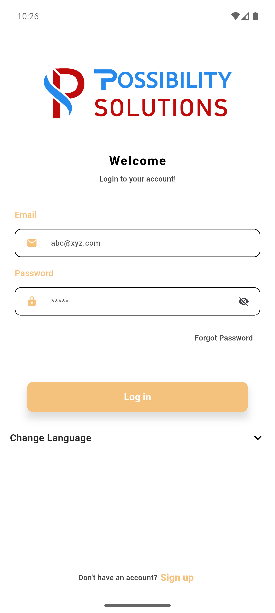
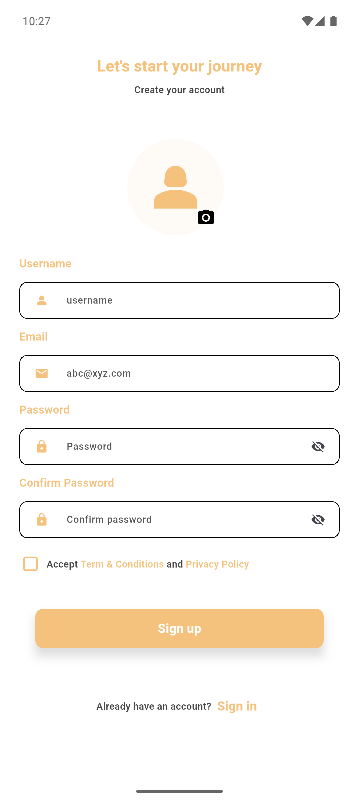
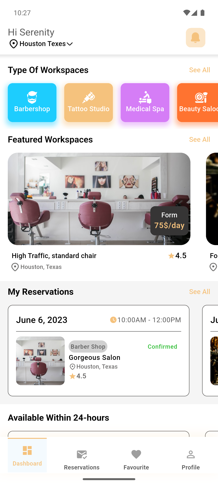
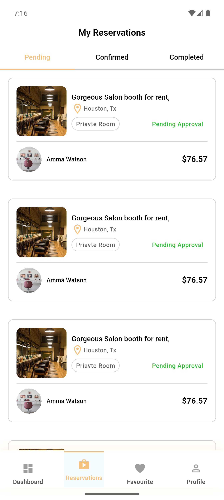

# Flutter-Clean-Architecture
A demo project with getx and MVVM followed by clean architecture


##  Overview
This project follows a structured approach to building scalable Flutter applications with GetX for state management and dependency injection. It implements Clean Architecture to separate concerns and improve maintainability.

##  Features
- **GetX for State Management**
- **MVVM Architecture**
- **Dio for API Calls**
- **Interceptor for API Authorization**
- **Caching with DioCacheInterceptor**
- **Shared Preferences for Local Storage**
- **SOLID Principles Implementation**

##  Project Structure
```
lib/
│
├── common/                # Shared utilities, themes, constants
│
├── app/                  
│   ├── exceptions/        # Custom exception handling
│   ├── global_widgets/    # Reusable UI components
│   ├── middlewares/       # Route guards and middlewares
│   ├── models/            # Entity definitions (business models)
│   ├── modules/           # Feature-based segregation 
│   │   ├── auth/          
│   │   │   ├── bindings/      # Dependency bindings
│   │   │   ├── controllers/   # State management using GetX
│   │   │   ├── services/      # Business logic and use cases
│   │   │   ├── views/         # UI components
│   │   │   ├── widgets/       # Reusable widgets on module level
│   │   ├── dashboard/        
│   │   ├── root/          # Root navigation & app entry point
│   ├── providers/         # API services and data sources
│   ├── routes/            # Navigation and route management
│   ├── services/          # Global services (e.g., Auth, Storage)
│
├── main.dart              # Application entry point

```


## Screenshots

Here are some screenshots of the example app demonstrating the key features of this package:

### Screenshot 1



### Screenshot 2



### Screenshot 3



### Screenshot 4




**MVVM Architecture in This Project**

This project follows the MVVM (Model–View–ViewModel) architecture using GetX to ensure a clean separation between UI, business logic, and data sources.

MVVM helps keep your code modular, testable, and easy to scale

**MVVM + Clean Architecture Flow (Diagram)**
```dart 
 ┌──────────────────────────────────────────────────────────┐
 │                        PRESENTATION                      │
 │                     (UI / View Layer)                    │
 └──────────────────────────────────────────────────────────┘
                            │
                            ▼
┌──────────────────────────────────────────────────────────┐
│                    VIEWMODEL (GetX Controller)           │
│    - Holds state (Rx)                                    │
│    - Handles user actions                                │
│    - Calls Services                                      │
│    - Updates UI reactively                               │
└──────────────────────────────────────────────────────────┘
                            │
                            ▼
┌──────────────────────────────────────────────────────────┐
│                        SERVICES                          │
│     - Business logic for the feature                     │
│     - Data preparation & validation                      │
│     - Communicates with Providers                        │
└──────────────────────────────────────────────────────────┘
                            │
                            ▼
┌──────────────────────────────────────────────────────────┐
│                        PROVIDERS                         │
│     - Responsible for API calls (Dio)                    │
│     - No business logic                                  │
│     - Returns raw responses to Services                  │
└──────────────────────────────────────────────────────────┘
                            │
                            ▼
┌──────────────────────────────────────────────────────────┐
│                       MODELS                             │
│     - Data structures                                    │
│     - JSON serialization                                 │
│     - Pure entities (no logic)                           │
└──────────────────────────────────────────────────────────┘
```

### **📌 How Each Layer Works in Your Project**

#### **1. View (UI Layer)**

📁 app/modules/**/views/

Displays data

Uses Obx, GetBuilder, GetView

No business logic

Example: Login screen, Dashboard screen.

#### **2. ViewModel (Controller Layer)**

📁 app/modules/**/controllers/

Holds reactive state variables (RxBool, RxString)

Handles button events

Talks to Services

Updates View

In GetX, Controller = ViewModel.

#### **3. Service (Use Case Layer)**

📁 app/modules/**/services/

Contains the business logic for that feature

Combines data from Providers if needed

Prepares the data for the ViewModel

Example:

Validate login data

Transform API response into a model

Save token using Shared Preferences

#### **4. Provider (Data Source Layer)**

📁 app/providers/

Makes API calls using Dio

Handles interceptors

Communicates with remote server

No logic — only gets/sends data

Example:

`dio.post("/login", data);`

#### **5. Models (Entity Layer)**

📁 app/models/

Represents structured data

Maps raw API response to Dart objects

Pure and reusable

Example:

UserModel

LoginResponseModel

### **🌐 Complete Flow Example (MVVM in Action)**

User taps “Login”

View → calls → ViewModel’s login()
ViewModel → calls → AuthService
AuthService → calls → AuthProvider
Provider → does API request
Response → returned to Service
Service → returns processed Model
ViewModel → updates reactive variables
UI (View) updates automatically (Obx)

### **📦 Folder Mapping With MVVM**

`` app/
     modules/
       login/
         views/        ← View
         controllers/  ← ViewModel
         services/     ← Business Logic
         widgets/      ← UI Components
   providers/          ← API Layer
   models/             ← Data Models`
 ``


